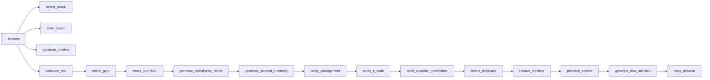

# NexusOS - Enterprise Incident Response Platform

NexusOS is an enterprise-grade incident response platform designed for autonomous incident triage, multi-agent coordination, compliance monitoring, and distributed Model Context Protocol (MCP) integrations.

> **Note**: This repository represents **Phase 1: Project Foundation**. It establishes the modular architecture, directory structure, TypeScript configurations, environment placeholders, PostgreSQL database connection wrapper, and minimal dashboard placeholder without active business logic, workflows, or MCP tools.

---

# Project Overview

Modern enterprises rely on multiple departments to respond to security incidents.

When ransomware, data breaches, insider threats, service outages, or unauthorized access occur, every department investigates independently using different systems, dashboards, workflows, and communication channels.
Security teams analyze threats.
Compliance teams verify regulatory obligations.
Operations teams decide mitigation strategies.
Communication teams notify stakeholders.
Because these departments rarely collaborate through a common intelligence platform, organizations experience:

- Slow incident response
- Conflicting recommendations
- Missed regulatory obligations
- Delayed stakeholder communication
- Increased operational losses
- Poor auditability
- Lack of explainable decision making

NexusOS solves this problem by introducing a collaborative enterprise intelligence platform powered by **distributed Model Context Protocol (MCP) servers**.
Instead of relying on a single AI model to make every decision, NexusOS enables specialized AI agents to collaborate through independent MCP servers while a deterministic Arbitration Engine produces the final enterprise-approved response.

---

# Purpose

NexusOS is designed to become an autonomous enterprise coordination platform capable of assisting organizations during critical incidents.
Its primary objective is to combine artificial intelligence with deterministic business rules to produce transparent, explainable, and enterprise-safe decisions.
The platform demonstrates how modern enterprises can safely integrate AI into incident response workflows without allowing a language model to become the ultimate decision maker.
Instead, AI generates structured recommendations while deterministic arbitration validates, prioritizes, and approves enterprise actions.

---

# Problem Statement

Traditional enterprise incident response suffers from fragmented decision-making.
Every department operates independently.
Each team uses different tools.
Each team maintains different knowledge.
Each team recommends different actions.

As organizations grow larger, these disconnected workflows create significant operational challenges:

- Longer Mean Time To Detect (MTTD)
- Longer Mean Time To Respond (MTTR)
- Increased financial losses
- Compliance violations
- Delayed customer communication
- Human decision bottlenecks
- Limited visibility across departments

Although modern AI assistants provide recommendations, they often lack:

- Department specialization
- Enterprise governance
- Deterministic reasoning
- Explainable workflows
- Safe tool orchestration
- Regulatory awareness
NexusOS addresses these limitations through collaborative multi-agent intelligence built upon the Model Context Protocol.

# Why NexusOS?

Unlike conventional AI assistants, NexusOS separates intelligence into specialized organizational domains.
Each enterprise function owns its own knowledge, tools, and decision logic.
Rather than asking one LLM to solve everything, NexusOS creates an ecosystem of collaborating enterprise experts.

The result is:

- Faster response times
- Explainable recommendations
- Modular architecture
- Secure enterprise integrations
- Deterministic approvals
- Reusable organizational knowledge
- Simplified scalability

# Architecture Goals

NexusOS is designed around six enterprise engineering goals.
## 1. Modularity
Every department owns an independent MCP server.
Adding a new department requires no changes to existing agents.

---

## 2. Explainability
Every recommendation contains:
- reasoning
- supporting evidence
- originating department
- generated actions
Nothing is hidden behind a black-box response.

---

## 3. Deterministic Decision Making
Language models generate recommendations.
Business rules approve decisions.
This ensures predictable enterprise behavior.

---

## 4. Enterprise Safety
No AI agent directly accesses enterprise systems.
Every action passes through controlled MCP tools.

---

## 5. Scalability

Departments can be added independently.
Future MCPs may include:
- Finance
- HR
- Legal
- Cloud Operations
- Infrastructure
- DevOps
- Procurement

without redesigning the architecture.

---

## 6. Auditability
Every incident records:
- tools invoked
- proposals generated
- final decisions
- timestamps
- execution history
creating a complete enterprise audit trail.

---

# Core Features

## Multi-Agent Collaboration

Specialized AI agents collaborate to solve enterprise incidents.

---

## Distributed MCP Servers

Independent enterprise MCP servers expose reusable tools and knowledge.

---

## Coordinator Agent

Coordinates communication between every department.

---

## Enterprise Security Intelligence
Threat detection
Asset scanning
Containment planning
Attack classification

---

## Compliance Intelligence
GDPR validation
Policy verification
Incident reporting
Regulatory compliance

---

## Intelligent Mail Monitoring
Email spike detection
Automatic stakeholder notification
Template-based communication

---
## Deterministic Arbitration

Final enterprise decisions are approved through deterministic business rules rather than language model outputs.

---

# Enterprise Use Cases

NexusOS supports enterprise-scale incident response scenarios including:

- Ransomware attacks
- Insider threats
- Unauthorized access
- Malware outbreaks
- Data breaches
- Cloud infrastructure failures
- Distributed denial-of-service (DDoS) attacks
- Compliance violations
- Enterprise email abuse
- Critical service outages
- Identity compromise
- Security Operations Center (SOC) orchestration
- Incident Command Centers
- Financial institutions
- Healthcare infrastructure
- Manufacturing environments
- Government agencies

---
# MCP Tool Reference

NexusOS is composed of sixteen enterprise-grade MCP tools distributed across four specialized MCP servers. Each tool encapsulates a specific business capability and exposes a standardized interface that can be invoked by AI agents through the Model Context Protocol (MCP).

---

# Security MCP

The Security MCP is responsible for enterprise threat detection, infrastructure investigation, containment planning, and cyber risk analysis.

---

## detect_attack()

### Purpose

Analyzes enterprise incidents to determine attack severity and classify potential cybersecurity threats.

### Input

- Incident
- Incident ID
- Severity

### Output

- Threat Classification
- Risk Level
- Recommended Security Actions

### Example

```text
Input:
10000 Failed Login Attempts

Output:
Critical Brute Force Attack
```

---

## scan_assets()

### Purpose

Scans enterprise infrastructure assets to identify affected systems and vulnerable components.

### Input

- Incident ID
- Target Systems

### Output

- Affected Systems
- Vulnerabilities
- Asset Scan Summary

---

## generate_timeline()

### Purpose

Constructs a chronological timeline of events related to an enterprise incident.

### Output

- Attack Timeline
- Event Sequence
- Investigation Timeline

---

## calculate_risk()

### Purpose

Calculates the enterprise risk score based on severity, infrastructure exposure, compliance impact, and business criticality.

### Output

- Risk Score (0–100)
- Business Impact
- Confidence Score

---

# Compliance MCP

The Compliance MCP validates organizational policies and regulatory requirements before enterprise actions are approved.

---

## check_gdpr()

### Purpose

Determines whether an incident involves personal data governed by GDPR.

### Input

- Incident
- Incident ID
- Personal Data Flag

### Output

- GDPR Status
- Required Actions
- Compliance Findings

---

## check_iso27001()

### Purpose

Evaluates the incident against ISO/IEC 27001 security controls.

### Output

- ISO Compliance Status
- Violated Controls
- Required Remediation

---

## generate_compliance_report()

### Purpose

Produces a comprehensive compliance assessment summarizing regulatory obligations.

### Output

- Compliance Report
- Regulatory Summary
- Recommended Documentation

---

## generate_incident_summary()

### Purpose

Creates a structured executive summary describing the incident and compliance implications.

### Output

- Executive Summary
- Incident Overview
- Compliance Recommendations

---

# Mail MCP

The Mail MCP coordinates enterprise communication and stakeholder notification during incidents.

---

## notify_management()

### Purpose

Generates executive-level notifications for senior management and organizational leadership.

### Output

- Executive Notification
- Priority Level
- Recipients

---

## notify_it_team()

### Purpose

Sends technical notifications to IT Operations teams responsible for infrastructure recovery.

### Input

- Incident ID
- Target Host

### Output

- Technical Alert
- Assigned Team
- Notification Status

---

## send_customer_notification()

### Purpose

Generates customer-facing communication during incidents affecting external users.

### Output

- Customer Email
- Service Status
- Communication Record

---

## close_incident()

### Purpose

Finalizes an incident after all approved actions have been executed and recorded.

### Output

- Closed Incident Record
- Resolution Summary
- Completion Timestamp

---

# Arbitration MCP

The Arbitration MCP is the deterministic decision engine of NexusOS. Rather than relying on an LLM for final decisions, it evaluates proposals from every departmental MCP using predefined business rules.

---

## collect_proposals()

### Purpose

Collects structured proposals generated by the Security, Compliance, and Mail MCPs.

### Output

- Aggregated Proposal Set

---

## resolve_conflicts()

### Purpose

Identifies conflicting recommendations and resolves them according to enterprise policies.

### Output

- Conflict Resolution
- Selected Recommendations

---

## prioritize_actions()

### Purpose

Ranks approved actions according to enterprise priority, business impact, and security urgency.

### Output

- Prioritized Action List

---

## generate_final_decision()

### Purpose

Produces the final enterprise decision by applying deterministic business rules to all collected proposals.

### Output

- Approved Enterprise Actions
- Decision Reasoning
- Audit Metadata

---

# Complete Tool Matrix

| MCP | Tool | Description |
|------|------|-------------|
| Security MCP | detect_attack() | Detects and classifies enterprise cyber threats. |
| Security MCP | scan_assets() | Scans enterprise infrastructure assets. |
| Security MCP | generate_timeline() | Produces an incident timeline. |
| Security MCP | calculate_risk() | Computes enterprise risk score. |
| Compliance MCP | check_gdpr() | Validates GDPR obligations. |
| Compliance MCP | check_iso27001() | Evaluates ISO/IEC 27001 compliance. |
| Compliance MCP | generate_compliance_report() | Creates compliance documentation. |
| Compliance MCP | generate_incident_summary() | Produces executive incident summaries. |
| Mail MCP | notify_management() | Notifies executive management. |
| Mail MCP | notify_it_team() | Sends alerts to IT Operations. |
| Mail MCP | send_customer_notification() | Sends customer-facing notifications. |
| Mail MCP | close_incident() | Finalizes and closes incidents. |
| Arbitration MCP | collect_proposals() | Aggregates departmental proposals. |
| Arbitration MCP | resolve_conflicts() | Resolves conflicting recommendations. |
| Arbitration MCP | prioritize_actions() | Orders actions by priority. |
| Arbitration MCP | generate_final_decision() | Produces the deterministic enterprise decision. |

---

# Tool Execution Pipeline



---

# Enterprise Tool Workflow

1. **Security MCP** analyzes the incident, scans infrastructure, builds a timeline, and computes a risk score.
2. **Compliance MCP** evaluates GDPR and ISO/IEC 27001 obligations, generates compliance documentation, and prepares an executive incident summary.
3. **Mail MCP** prepares notifications for management, IT teams, and affected customers.
4. **Arbitration MCP** aggregates all proposals, resolves conflicts, prioritizes actions, and generates the final deterministic decision.
5. Once all approved actions are completed, the incident is officially closed and archived with a complete audit trail.

## Architecture & Module Directory Overview

The project is structured modularly to allow seamless extension in future phases:

```
nexus-os/
├── .env.example                  # Environment configuration template
├── README.md                     # Project architecture & module guide
├── package.json                  # Dependencies & execution scripts
├── tsconfig.json                 # Strict TypeScript configuration
├── vite.config.ts                # Vite build & path aliasing setup
├── index.html                    # Single Page App html container
├── src/
│   ├── main.tsx                  # Application bootstrap entry point
│   ├── dashboard/                # Enterprise Dashboard Module
│   │   ├── Dashboard.tsx         # Minimal UI placeholder component
│   │   └── dashboard.css         # Modern dark enterprise theme styles
│   ├── mcps/                     # Distributed MCP Servers (Placeholders)
│   │   ├── security/             # Security MCP Server (threat analysis & containment)
│   │   ├── compliance/           # Compliance MCP Server (regulatory audits & policy)
│   │   ├── mail/                 # Mail MCP Server (alerts & stakeholder communications)
│   │   └── arbitration/          # Arbitration MCP Server (agent conflict resolution)
│   ├── agents/                   # AI Agents Module
│   │   └── coordinator/          # Coordinator Agent (multi-agent orchestration)
│   ├── database/                 # Database Layer
│   │   └── connection.ts         # PostgreSQL connection pool configuration placeholder
│   ├── models/                   # Shared Domain Models (Interfaces & Types)
│   ├── services/                 # Cross-Cutting Shared Services
│   └── config/                   # Central Application & Environment Configuration
```

---

## Module Descriptions

| Module Path | Purpose & Responsibilities |
| :--- | :--- |
| `src/mcps/security/` | **Security MCP**: Interface for threat isolation, firewall rule updates, and security telemetry analysis. |
| `src/mcps/compliance/` | **Compliance MCP**: Interface for regulatory compliance checks, audit trail verification, and policy enforcement. |
| `src/mcps/mail/` | **Mail MCP**: Interface for outbound automated notifications, email digests, and incident escalation messaging. |
| `src/mcps/arbitration/` | **Arbitration MCP**: Interface for resolving conflicting recommendations between autonomous agents. |
| `src/agents/coordinator/` | **Coordinator Agent**: Multi-agent orchestrator managing event dispatch, workflow state, and plan execution. |
| `src/database/` | **Database Layer**: Manages PostgreSQL connection pooling (`pg.Pool`). Strictly configuration only in Phase 1. |
| `src/dashboard/` | **Enterprise Dashboard**: React-based dashboard displaying system header, brand, and incident state. |
| `src/models/` | **Shared Models**: Centralized TypeScript types and domain entities shared across MCPs and agents. |
| `src/services/` | **Shared Services**: Reusable cross-cutting infrastructure services (logging, bus messaging, caching). |
| `src/config/` | **Configuration**: Environment variable loader and application settings manager. |

---

## 🚀 Getting Started

### Prerequisites

- **Node.js**: v18.x or higher
- **npm**: v9.x or higher

### Installation & Execution

1. Clone or copy environment variable placeholders:
   ```bash
   cp .env.example .env
   ```

2. Install dependencies:
   ```bash
   npm install
   ```

3. Typecheck project TypeScript files:
   ```bash
   npm run typecheck
   ```

4. Start local development dashboard server:
   ```bash
   npm run dev
   ```

5. Build for production distribution:
   ```bash
   npm run build
   ```

---

## 📌 Phase Roadmap

- [x] **Phase 1**: Project Foundation, TS Architecture, Directory Scaffolding, DB Connection Placeholder, Dashboard UI Placeholder.
- [ ] **Phase 2**: Core Database Schema & Model Definitions.
- [ ] **Phase 3**: Distributed MCP Server Implementations (Security, Compliance, Mail, Arbitration).
- [ ] **Phase 4**: Coordinator AI Agent & Triage Workflows.
- [ ] **Phase 5**: Full Incident Dashboard Integration & Analytics.
